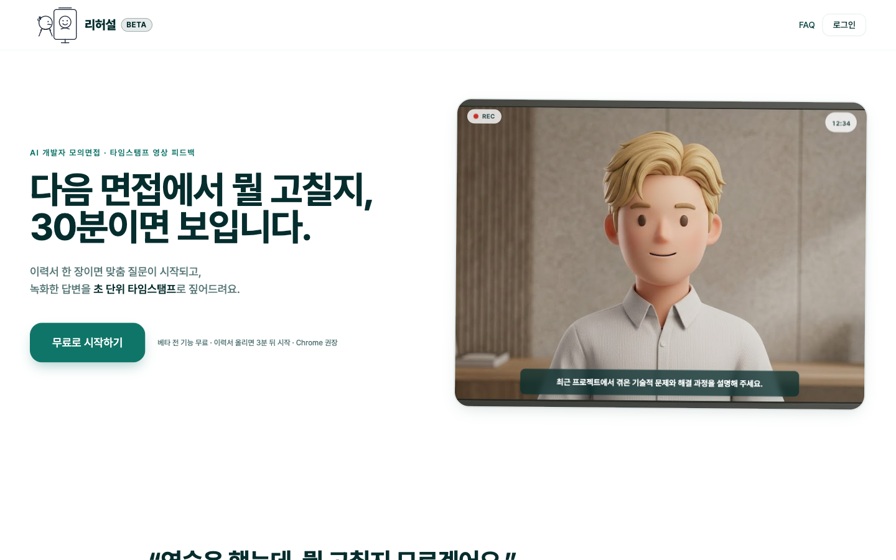
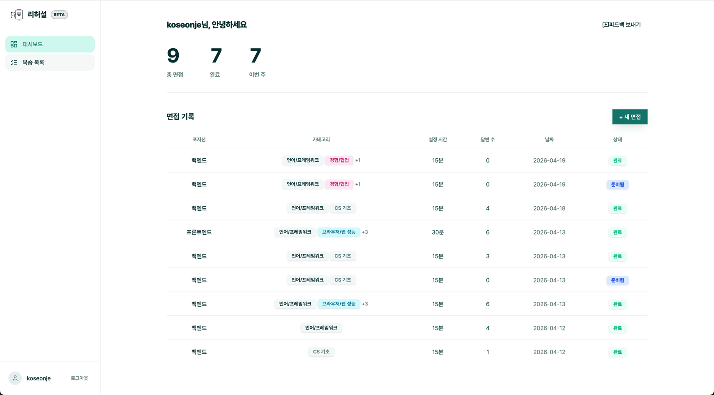
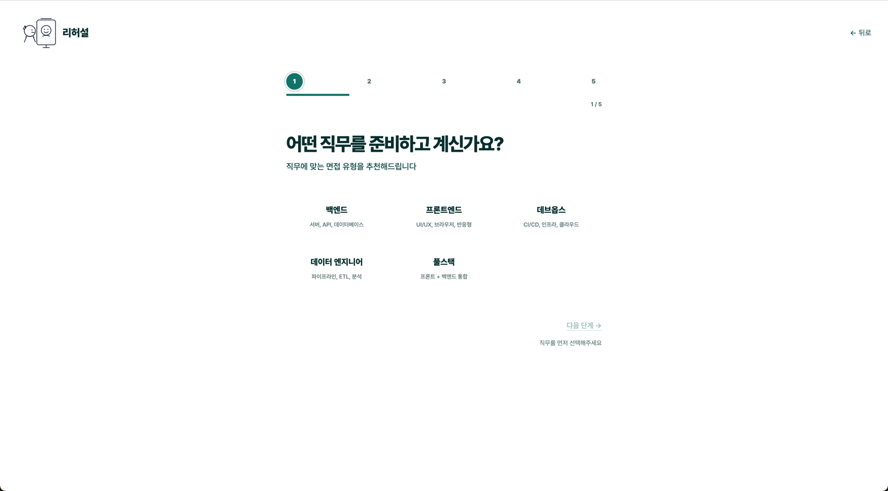
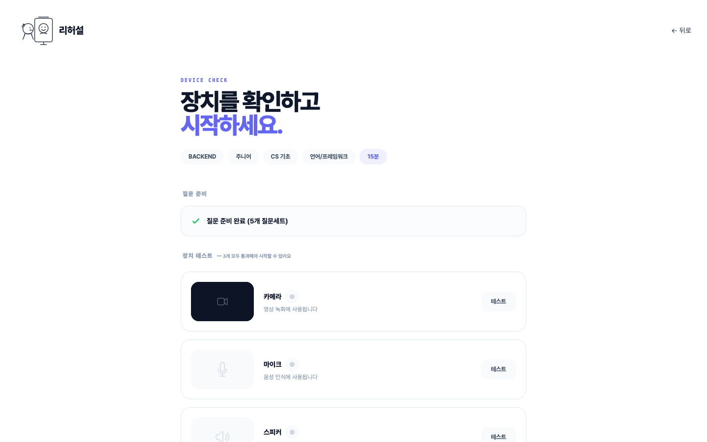
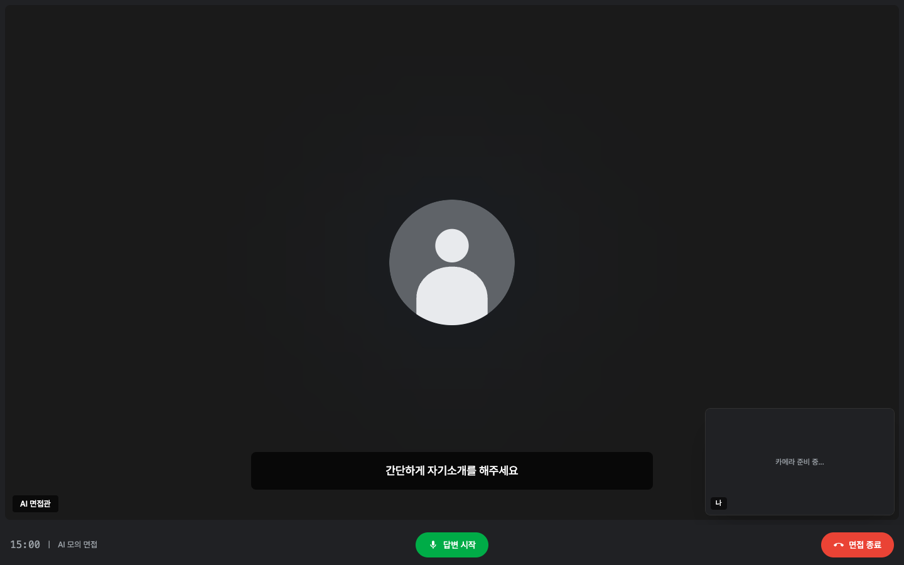
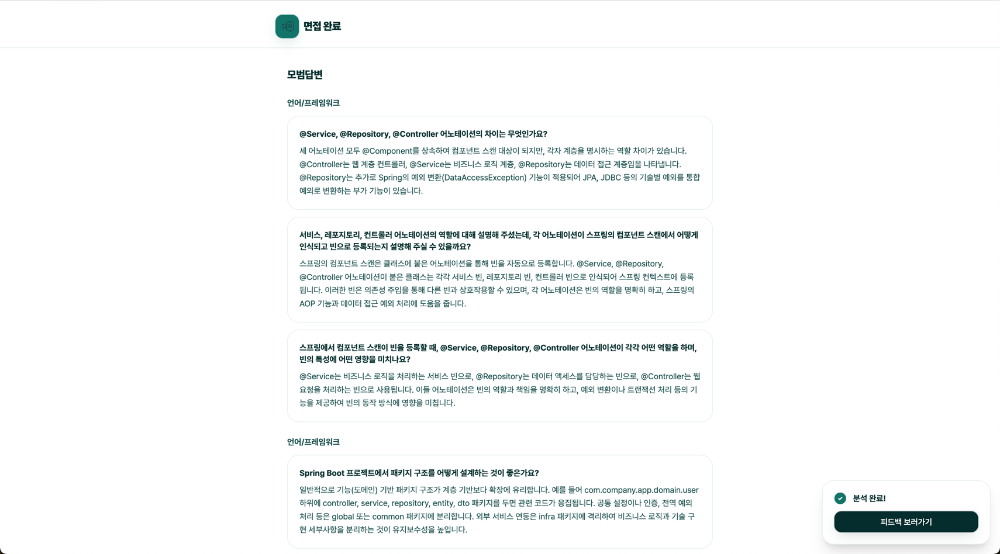
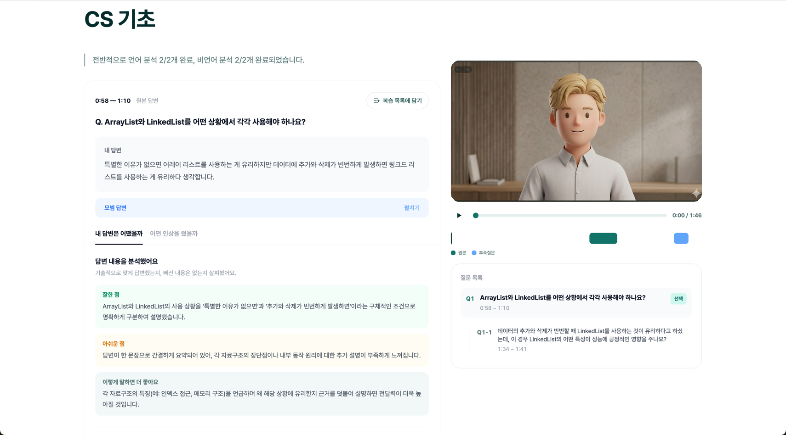

# Rehearse (리허설)

> 모의면접을 녹화한 뒤, AI 피드백을 영상의 **정확한 시점**에 고정합니다 — 점수가 아닌, 타임스탬프로 복기하는 개발자 면접 연습 플랫폼.


**🌐 Live Demo → [www.rehearse.co.kr](https://www.rehearse.co.kr)** · 베타 전 기능 무료



---

## Why Rehearse?

기존 AI 면접 서비스는 면접이 끝나면 **텍스트 점수표**만 제공합니다.
"표정이 불안했습니다" 같은 피드백을 받아도, 어느 시점에서 그랬는지 확인할 방법이 없습니다.

Rehearse는 녹화된 면접 영상 위에 피드백을 **타임스탬프**로 연결합니다.
피드백을 클릭하면 해당 장면으로 점프해, 자신의 말투·표정·답변을 직접 보며 복기할 수 있습니다.

|  | 기존 서비스 | Rehearse |
|--|-----------|----------|
| 피드백 | 면접 종료 후 텍스트 점수표 | **타임스탬프 기반 영상+피드백 동기화** |
| 비언어 분석 | 없음 또는 추상적 점수 | **GPT-4o Vision 시선·표정·자세 분석** |
| 개발자 특화 | 범용 BQ 중심 | **이력서 PDF 기반 CS·시스템 설계·행동 면접** |
| 후속 질문 | 고정 질문 목록 | **답변 맥락 기반 AI 실시간 생성** |

---

## 핵심 기능

### 1. 이력서 기반 맞춤 질문

이력서 PDF 한 장을 업로드하면, 직무·경력·기술스택을 파싱해 **내 프로젝트에 파고드는 CS·시스템 설계·행동 질문**을 자동 생성합니다. 범용 BQ 템플릿이 아닌, 내가 실제로 썼다고 적은 기술에 대한 질문이 나옵니다.

### 2. AI 면접관과 실시간 대화

AI 면접관이 내 답변을 듣고 **심화·보충·반론** 후속 질문을 즉석에서 생성합니다. 최대 3라운드까지, 고정된 질문 리스트가 아니라 대화가 이어집니다. Google Meet 스타일 1:1 면접 UI로 실제 면접 긴장감까지 재현합니다.

### 3. 타임스탬프 동기화 피드백 *(핵심 차별점)*

피드백 카드를 클릭하면 영상이 정확히 그 순간으로 점프합니다. "0:42 — 시선 흔들림" 같은 추상 문구 대신, **몇 분 몇 초 구간에 무엇이 일어났는지** 영상 위에서 직접 확인합니다. 타임라인 · 피드백 · 영상이 하나의 시간축으로 묶입니다.

### 4. 비언어 분석 (GPT-4o Vision)

시선 회피 · 표정 경직 · 자세 불안정 · 말하기 속도 · 습관어("어…", "그…") 횟수를 **시점별로** 집계합니다. 면접 종료 즉시 `S3 업로드 → EventBridge → Lambda (Whisper STT + GPT-4o Vision)` 파이프라인이 자동으로 돌아갑니다.

### 5. 종합 리포트 & 모범 답안

100점 만점 종합 점수, 강점·보완점 요약, 그리고 **각 질문별 모범 답안**을 함께 제공합니다. "다음에 어떻게 말하면 더 좋을지"를 같은 화면에서 바로 확인할 수 있습니다.

---

**👉 지금 사용해보기 → [www.rehearse.co.kr](https://www.rehearse.co.kr)** · 로그인 후 이력서 PDF만 있으면 3분 안에 시작됩니다.

---

## 사용자 플로우

### 0. 대시보드



로그인하면 면접 대시보드가 메인 화면으로 표시됩니다. 좌측 사이드바에서 **대시보드 / 복습 목록**을 오가며, 우측 상단 `+ 새 면접` 버튼으로 바로 면접을 시작할 수 있습니다.

- **통계 카드**: 총 면접 수, 완료, 이번 주 면접 수를 한눈에 확인
- **면접 기록 테이블**: 포지션 · 카테고리 · 설정 시간 · 답변 수 · 날짜 · 상태 컬럼
- **바로가기**: `완료` 행 클릭 → 타임스탬프 피드백 리뷰, `준비됨` 행 → 이어하기
- **피드백 보내기**: 상단 우측 버튼으로 베타 사용 중 의견 바로 제출

### 1. 면접 설정



5단계 위저드로 면접을 구성합니다.

- **Step 1 — 직무**: 백엔드 / 프론트엔드 / 데브옵스 / 데이터 엔지니어 / 풀스택
- **Step 2 — 레벨**: 주니어 · 미드 · 시니어
- **Step 3 — 면접 유형**: CS 기초, 언어/프레임워크, 경험/협업, 시스템 설계 등 (다중 선택)
- **Step 4 — 시간**: 15분 / 30분
- **Step 5 — 이력서**: PDF 드래그앤드롭 → 텍스트 추출 → 맞춤 질문 생성

### 2. 장치 확인 & 면접 준비



AI가 질문세트(기본 5개)를 생성하는 동안, 카메라·마이크·스피커 3개 장치 테스트를 모두 통과해야 `면접 시작하기` 버튼이 활성화됩니다. 실제 면접 직전 긴장을 줄이는 워밍업 단계입니다.

### 3. AI 면접 진행



Google Meet 스타일의 면접 화면에서 AI 면접관과 1:1 모의면접을 진행합니다.

- 중앙에 AI 면접관 아바타, 우측 하단에 내 영상 PIP
- 하단 캡션으로 질문 텍스트 표시
- 답변 후 심화/보충/반론 후속 질문 자동 생성 (최대 3라운드)
- 질문 세트별 영상 녹화 → S3 자동 업로드

### 4. 분석 대기 & 모범답변



면접이 끝나면 `S3 업로드 → Lambda (Whisper STT + GPT-4o Vision)` 분석이 백그라운드로 돌아가는 동안, 같은 화면에서 **질문별 모범답변**을 먼저 확인할 수 있습니다. 분석이 완료되면 우측 하단 `분석 완료!` 토스트와 함께 `피드백 보러가기` 버튼이 활성화됩니다.

### 5. 타임스탬프 피드백 리뷰



좌측 분석 패널과 우측 영상 플레이어가 같은 시간축으로 묶입니다. 질문 목록의 원본/후속 질문 중 하나를 고르면 영상이 해당 구간(`0:58 ~ 1:10` 등)으로 점프하고, 좌측 카드가 그 답변의 분석으로 전환됩니다.

- **내 답변은 어땠을까 (언어 분석)** — `잘한 점` · `아쉬운 점` · `이렇게 말하면 더 좋아요` 세 블록으로 기술적 정합성과 구조를 진단
- **어떤 인상을 줬을까 (비언어 분석)** — 시선·표정·자세·말하기 속도를 시점별로 요약
- **모범 답변** — 같은 질문에 대한 참고 답변을 펼쳐보기
- **복습 목록에 담기** — 아쉬웠던 답변을 저장해 사이드바 `복습 목록`에서 모아 재확인

---

## Tech Stack

| Layer | Technology |
|-------|-----------|
| **Frontend** | React 18, TypeScript 5.9, Vite, Tailwind CSS |
| **상태관리** | Zustand (client), TanStack Query (server) |
| **Backend** | Java 21, Spring Boot 3.4, Spring Data JPA |
| **Database** | MySQL 8.0 (prod) · H2 (local dev) |
| **AI — 질문/피드백** | Claude API (`claude-sonnet-4-20250514`) |
| **AI — 분석** | OpenAI Whisper (STT), GPT-4o (Vision + LLM) |
| **Infra** | AWS S3, EventBridge, Lambda (Python 3.12), CloudFront |
| **영상** | MediaRecorder (WebM), FFmpeg, MediaConvert |
| **배포** | EC2, Docker Compose, Nginx, ECR |

---

## Quick Start

### Prerequisites

- Java 21+
- Node.js 20+
- Git

### Backend

```bash
git clone https://github.com/KoSeonJe/devlens.git
cd devlens/backend
./gradlew bootRun
# 기본 프로필: local (H2 인메모리 DB, API 키 불필요)
# http://localhost:8080/actuator/health 로 상태 확인
```

### Frontend

```bash
cd devlens/frontend
npm install
npm run dev
# http://localhost:5173 에서 접속
```

> **참고**: Local 프로필에서는 H2 인메모리 DB를 사용하며, Claude/OpenAI API 키 없이도 기본 흐름을 확인할 수 있습니다. AI 질문 생성·분석 기능을 사용하려면 환경변수를 설정하세요.

---

## 환경변수

### Backend (`dev` / `prod` 프로필)

| Variable | Required | Description | Default |
|----------|----------|-------------|---------|
| `DB_URL` | Yes | MySQL JDBC URL | — |
| `DB_USERNAME` | Yes | DB 사용자명 | — |
| `DB_PASSWORD` | Yes | DB 비밀번호 | — |
| `CLAUDE_API_KEY` | Yes | Claude API 키 (질문 생성, 피드백) | — |
| `CLAUDE_MODEL` | No | Claude 모델 ID | `claude-sonnet-4-20250514` |
| `OPENAI_API_KEY` | No | OpenAI API 키 (후속질문 음성 분석) | — |
| `OPENAI_MODEL` | No | OpenAI 모델 ID | `gpt-4o-mini` |
| `AWS_ACCESS_KEY_ID` | Yes | AWS 액세스 키 | — |
| `AWS_SECRET_ACCESS_KEY` | Yes | AWS 시크릿 키 | — |
| `AWS_REGION` | No | AWS 리전 | `ap-northeast-2` |
| `AWS_S3_BUCKET` | No | S3 버킷명 | `rehearse-videos-dev` |
| `INTERNAL_API_KEY` | Yes | Lambda↔Backend 내부 API 키 | — |
| `CORS_ALLOWED_ORIGINS` | Yes | CORS 허용 도메인 | — |

> `local` 프로필에서는 H2 인메모리 DB를 사용하므로 위 환경변수가 불필요합니다.

