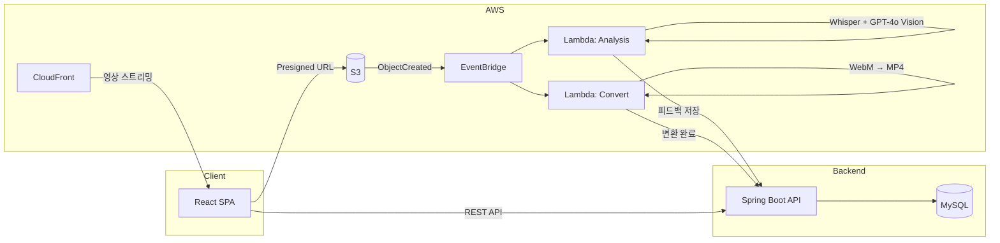

# Rehearse (리허설)

> 모의면접을 녹화한 뒤, AI 피드백을 영상의 **정확한 시점**에 고정합니다 — 점수가 아닌, 타임스탬프로 복기하는 개발자 면접 연습 플랫폼.


---

## Why Rehearse?

기존 AI 면접 서비스는 면접이 끝나면 텍스트 점수표만 제공합니다.
"표정이 불안했습니다" 같은 피드백을 받아도, **어느 시점에서 그랬는지** 확인할 방법이 없습니다.

Rehearse는 녹화된 면접 영상 위에 피드백을 타임스탬프로 연결합니다.
피드백을 클릭하면 해당 장면으로 이동하여, 자신의 답변과 표정을 직접 확인하며 복기할 수 있습니다.

|  | 기존 서비스 | Rehearse |
|--|-----------|----------|
| 피드백 | 면접 종료 후 텍스트 점수표 | **타임스탬프 기반 영상+피드백 동기화** |
| 비언어 분석 | 없음 또는 추상적 점수 | **GPT-4o Vision 시선·표정·자세 분석** |
| 개발자 특화 | 범용 BQ 중심 | **이력서 PDF 기반 CS·시스템 설계·행동 면접** |
| 후속 질문 | 고정 질문 목록 | **답변 맥락 기반 AI 실시간 생성** |

---

## 주요 기능

- **이력서 기반 맞춤 질문** — PDF 업로드 시 AI가 직무·레벨에 맞는 면접 질문 자동 생성
- **실시간 후속 질문** — 답변 내용에 따라 심화·보충·반론 질문을 즉석 생성
- **영상 녹화 + S3 업로드** — 질문 세트별 WebM 녹화, Presigned URL로 직접 업로드
- **자동 분석 파이프라인** — S3 업로드 → EventBridge → Lambda (Whisper STT + GPT-4o Vision)
- **타임스탬프 동기화 피드백** — 영상 플레이어와 피드백 카드가 실시간 동기화
- **비언어 분석** — 시선 회피, 표정 경직, 자세 불안정 등을 시점별로 감지
- **종합 리포트** — 100점 만점 종합 점수 + 강점·보완점 요약

---

## 사용자 플로우

### 1. 면접 설정


5단계 위저드로 면접을 구성합니다.

- **직무 선택**: Backend, Frontend, DevOps, Data Engineer, Fullstack
- **레벨 선택**: Junior, Mid, Senior
- **면접 유형**: CS 기초, 언어/프레임워크, 시스템 설계, 행동 면접 등
- **이력서 업로드**: PDF 드래그앤드롭 → 텍스트 추출 → 맞춤 질문 생성

### 2. 장치 확인 & 면접 준비


카메라·마이크·스피커 3개 장치 테스트를 통과해야 면접을 시작할 수 있습니다.
AI가 질문을 생성하는 동안 장치를 점검하세요.

### 3. AI 면접 진행


Google Meet 스타일의 면접 화면에서 AI 면접관과 1:1 모의면접을 진행합니다.

- 중앙에 AI 면접관 아바타, 우측 하단에 내 영상 PIP
- 하단 캡션으로 질문 텍스트 표시
- 답변 후 심화/보충/반론 후속 질문 자동 생성 (최대 3라운드)
- 질문 세트별 영상 녹화 → S3 자동 업로드

### 4. 분석 대기


면접 종료 후 Lambda가 자동으로 분석을 시작합니다.
각 질문 세트별 진행 상황을 실시간으로 확인할 수 있으며, 모범 답안도 함께 제공됩니다.

### 5. 타임스탬프 피드백 리뷰


영상 플레이어와 피드백 패널이 동기화됩니다.
타임라인 마커나 피드백 카드를 클릭하면 해당 장면으로 바로 이동합니다.

- **언어 피드백**: 답변 논리성, 구조, 핵심 키워드 포함 여부
- **비언어 피드백**: 시선 회피, 표정 경직, 자세 불안정 등 시점별 분석

---

## Tech Stack

| Layer | Technology |
|-------|-----------|
| **Frontend** | React 18, TypeScript 5.9, Vite, Tailwind CSS |
| **상태관리** | Zustand (client), TanStack Query (server) |
| **Backend** | Java 21, Spring Boot 3.4, Spring Data JPA |
| **Database** | MySQL 8.0 (prod) · H2 (local dev) |
| **AI — 질문/피드백** | Claude API (`claude-sonnet-4-20250514`) |
| **AI — 분석** | OpenAI Whisper (STT), GPT-4o (Vision + LLM) |
| **Infra** | AWS S3, EventBridge, Lambda (Python 3.12), CloudFront |
| **영상** | MediaRecorder (WebM), FFmpeg, MediaConvert |
| **배포** | EC2, Docker Compose, Nginx, ECR |

---

## Architecture



---

## Quick Start

### Prerequisites

- Java 21+
- Node.js 20+
- Git

### Backend

```bash
git clone https://github.com/KoSeonJe/devlens.git
cd devlens/backend
./gradlew bootRun
# 기본 프로필: local (H2 인메모리 DB, API 키 불필요)
# http://localhost:8080/actuator/health 로 상태 확인
```

### Frontend

```bash
cd devlens/frontend
npm install
npm run dev
# http://localhost:5173 에서 접속
```

> **참고**: Local 프로필에서는 H2 인메모리 DB를 사용하며, Claude/OpenAI API 키 없이도 기본 흐름을 확인할 수 있습니다. AI 질문 생성·분석 기능을 사용하려면 환경변수를 설정하세요.

---

## 환경변수

### Backend (`dev` / `prod` 프로필)

| Variable | Required | Description | Default |
|----------|----------|-------------|---------|
| `DB_URL` | Yes | MySQL JDBC URL | — |
| `DB_USERNAME` | Yes | DB 사용자명 | — |
| `DB_PASSWORD` | Yes | DB 비밀번호 | — |
| `CLAUDE_API_KEY` | Yes | Claude API 키 (질문 생성, 피드백) | — |
| `CLAUDE_MODEL` | No | Claude 모델 ID | `claude-sonnet-4-20250514` |
| `OPENAI_API_KEY` | No | OpenAI API 키 (후속질문 음성 분석) | — |
| `OPENAI_MODEL` | No | OpenAI 모델 ID | `gpt-4o-mini` |
| `AWS_ACCESS_KEY_ID` | Yes | AWS 액세스 키 | — |
| `AWS_SECRET_ACCESS_KEY` | Yes | AWS 시크릿 키 | — |
| `AWS_REGION` | No | AWS 리전 | `ap-northeast-2` |
| `AWS_S3_BUCKET` | No | S3 버킷명 | `rehearse-videos-dev` |
| `INTERNAL_API_KEY` | Yes | Lambda↔Backend 내부 API 키 | — |
| `CORS_ALLOWED_ORIGINS` | Yes | CORS 허용 도메인 | — |

> `local` 프로필에서는 H2 인메모리 DB를 사용하므로 위 환경변수가 불필요합니다.

