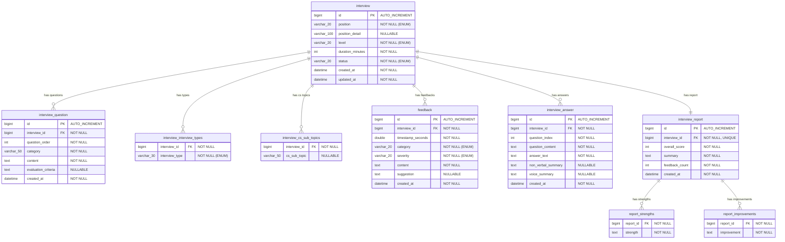

# DevLens (Rehearse) ERD — Entity Relationship Diagram

> 최종 업데이트: 2026-03-16

## ERD 다이어그램



---

## 테이블 상세

### 1. `interview` — 면접 세션

| 컬럼 | 타입 | 제약조건 | 설명 |
|------|------|----------|------|
| `id` | `BIGINT` | PK, AUTO_INCREMENT | 면접 세션 ID |
| `position` | `VARCHAR(20)` | NOT NULL | 포지션 (ENUM: Position) |
| `position_detail` | `VARCHAR(100)` | NULLABLE | 포지션 상세 설명 |
| `level` | `VARCHAR(20)` | NOT NULL | 경력 레벨 (ENUM: InterviewLevel) |
| `duration_minutes` | `INT` | NOT NULL | 면접 시간(분) |
| `status` | `VARCHAR(20)` | NOT NULL | 면접 상태 (ENUM: InterviewStatus) |
| `created_at` | `DATETIME` | NOT NULL | 생성 시각 (JPA Auditing) |
| `updated_at` | `DATETIME` | NOT NULL | 수정 시각 (JPA Auditing) |

- JPA: `@Entity`, `@EntityListeners(AuditingEntityListener.class)`
- 소스: `com.devlens.api.domain.interview.entity.Interview`

### 2. `interview_question` — 면접 질문

| 컬럼 | 타입 | 제약조건 | 설명 |
|------|------|----------|------|
| `id` | `BIGINT` | PK, AUTO_INCREMENT | 질문 ID |
| `interview_id` | `BIGINT` | FK → `interview.id`, NOT NULL | 면접 세션 참조 |
| `question_order` | `INT` | NOT NULL | 질문 순서 |
| `category` | `VARCHAR(50)` | NOT NULL | 질문 카테고리 |
| `content` | `TEXT` | NOT NULL | 질문 내용 |
| `evaluation_criteria` | `TEXT` | NULLABLE | 평가 기준 |
| `created_at` | `DATETIME` | NOT NULL | 생성 시각 |

- 관계: `interview` → `interview_question` (1:N, `CASCADE ALL`, `orphanRemoval`)
- 정렬: `@OrderBy("questionOrder ASC")`
- 소스: `com.devlens.api.domain.interview.entity.InterviewQuestion`

### 3. `interview_interview_types` — 면접 유형 (ElementCollection)

| 컬럼 | 타입 | 제약조건 | 설명 |
|------|------|----------|------|
| `interview_id` | `BIGINT` | FK → `interview.id`, NOT NULL | 면접 세션 참조 |
| `interview_type` | `VARCHAR(30)` | NOT NULL | 면접 유형 (ENUM: InterviewType) |

- JPA: `@ElementCollection`, `@CollectionTable`
- 소스: `Interview.interviewTypes` 필드

### 4. `interview_cs_sub_topics` — CS 세부 주제 (ElementCollection)

| 컬럼 | 타입 | 제약조건 | 설명 |
|------|------|----------|------|
| `interview_id` | `BIGINT` | FK → `interview.id`, NOT NULL | 면접 세션 참조 |
| `cs_sub_topic` | `VARCHAR(50)` | NULLABLE | CS 세부 주제명 |

- JPA: `@ElementCollection`, `@CollectionTable`
- 소스: `Interview.csSubTopics` 필드

### 5. `feedback` — AI 피드백

| 컬럼 | 타입 | 제약조건 | 설명 |
|------|------|----------|------|
| `id` | `BIGINT` | PK, AUTO_INCREMENT | 피드백 ID |
| `interview_id` | `BIGINT` | FK → `interview.id`, NOT NULL | 면접 세션 참조 |
| `timestamp_seconds` | `DOUBLE` | NOT NULL | 피드백 시점(초) |
| `category` | `VARCHAR(20)` | NOT NULL | 카테고리 (ENUM: FeedbackCategory) |
| `severity` | `VARCHAR(20)` | NOT NULL | 심각도 (ENUM: FeedbackSeverity) |
| `content` | `TEXT` | NOT NULL | 피드백 내용 |
| `suggestion` | `TEXT` | NULLABLE | 개선 제안 |
| `created_at` | `DATETIME` | NOT NULL | 생성 시각 |

- 관계: `interview` → `feedback` (1:N)
- 소스: `com.devlens.api.domain.feedback.entity.Feedback`

### 6. `interview_answer` — 면접 답변

| 컬럼 | 타입 | 제약조건 | 설명 |
|------|------|----------|------|
| `id` | `BIGINT` | PK, AUTO_INCREMENT | 답변 ID |
| `interview_id` | `BIGINT` | FK → `interview.id`, NOT NULL | 면접 세션 참조 |
| `question_index` | `INT` | NOT NULL | 질문 순서 (0-based) |
| `question_content` | `TEXT` | NOT NULL | 질문 내용 |
| `answer_text` | `TEXT` | NOT NULL | 답변 내용 |
| `non_verbal_summary` | `TEXT` | NULLABLE | 비언어 분석 요약 |
| `voice_summary` | `TEXT` | NULLABLE | 음성 분석 요약 |
| `created_at` | `DATETIME` | NOT NULL | 생성 시각 |

- 관계: `interview` → `interview_answer` (1:N)
- 소스: `com.devlens.api.domain.feedback.entity.InterviewAnswer`

### 7. `interview_report` — 종합 리포트

| 컬럼 | 타입 | 제약조건 | 설명 |
|------|------|----------|------|
| `id` | `BIGINT` | PK, AUTO_INCREMENT | 리포트 ID |
| `interview_id` | `BIGINT` | FK → `interview.id`, NOT NULL, UNIQUE | 면접 세션 참조 (1:1) |
| `overall_score` | `INT` | NOT NULL | 종합 점수 |
| `summary` | `TEXT` | NOT NULL | 종합 요약 |
| `feedback_count` | `INT` | NOT NULL | 피드백 수 |
| `created_at` | `DATETIME` | NOT NULL | 생성 시각 |

- 관계: `interview` → `interview_report` (1:1, `@OneToOne`)
- 소스: `com.devlens.api.domain.report.entity.InterviewReport`

### 8. `report_strengths` — 리포트 강점 (ElementCollection)

| 컬럼 | 타입 | 제약조건 | 설명 |
|------|------|----------|------|
| `report_id` | `BIGINT` | FK → `interview_report.id`, NOT NULL | 리포트 참조 |
| `strength` | `TEXT` | NOT NULL | 강점 내용 |

- JPA: `@ElementCollection`, `@CollectionTable`
- 소스: `InterviewReport.strengths` 필드

### 9. `report_improvements` — 리포트 개선점 (ElementCollection)

| 컬럼 | 타입 | 제약조건 | 설명 |
|------|------|----------|------|
| `report_id` | `BIGINT` | FK → `interview_report.id`, NOT NULL | 리포트 참조 |
| `improvement` | `TEXT` | NOT NULL | 개선점 내용 |

- JPA: `@ElementCollection`, `@CollectionTable`
- 소스: `InterviewReport.improvements` 필드

---

## Enum 정의

### Position (포지션)

| 값 | 설명 |
|----|------|
| `BACKEND` | 백엔드 |
| `FRONTEND` | 프론트엔드 |
| `DEVOPS` | 데브옵스 |
| `DATA_ENGINEER` | 데이터 엔지니어 |
| `FULLSTACK` | 풀스택 |

### InterviewLevel (경력 레벨)

| 값 | 설명 |
|----|------|
| `JUNIOR` | 주니어 |
| `MID` | 미드 |
| `SENIOR` | 시니어 |

### InterviewType (면접 유형)

| 값 | 설명 | 대상 |
|----|------|------|
| `CS_FUNDAMENTAL` | CS 기초 | 공통 |
| `BEHAVIORAL` | 인성/행동 면접 | 공통 |
| `RESUME_BASED` | 이력서 기반 | 공통 |
| `JAVA_SPRING` | Java/Spring | 백엔드 |
| `SYSTEM_DESIGN` | 시스템 설계 | 백엔드 |
| `FULLSTACK_JS` | 풀스택 JS | 풀스택 |
| `REACT_COMPONENT` | React 컴포넌트 | 프론트엔드 |
| `BROWSER_PERFORMANCE` | 브라우저 성능 | 프론트엔드 |
| `INFRA_CICD` | 인프라/CI·CD | 데브옵스 |
| `CLOUD` | 클라우드 | 데브옵스 |
| `DATA_PIPELINE` | 데이터 파이프라인 | 데이터 |
| `SQL_MODELING` | SQL/모델링 | 데이터 |

### InterviewStatus (면접 상태)

```
READY → IN_PROGRESS → COMPLETED
```

| 값 | 설명 | 전이 가능 |
|----|------|-----------|
| `READY` | 준비 완료 | → `IN_PROGRESS` |
| `IN_PROGRESS` | 진행 중 | → `COMPLETED` |
| `COMPLETED` | 완료 | 전이 불가 |

### FeedbackCategory (피드백 카테고리)

| 값 | 설명 |
|----|------|
| `VERBAL` | 언어적 표현 |
| `NON_VERBAL` | 비언어적 표현 |
| `CONTENT` | 답변 내용 |

### FeedbackSeverity (피드백 심각도)

| 값 | 설명 |
|----|------|
| `INFO` | 정보 |
| `WARNING` | 경고 |
| `SUGGESTION` | 제안 |

---

## 관계 요약

| 관계 | 타입 | JPA 매핑 | 비고 |
|------|------|----------|------|
| `interview` → `interview_question` | 1:N | `@OneToMany(cascade=ALL, orphanRemoval=true)` | 양방향 |
| `interview` → `interview_interview_types` | 1:N | `@ElementCollection` | 단방향 |
| `interview` → `interview_cs_sub_topics` | 1:N | `@ElementCollection` | 단방향 |
| `interview` → `feedback` | 1:N | `@ManyToOne(fetch=LAZY)` | 단방향 (Feedback → Interview) |
| `interview` → `interview_answer` | 1:N | `@ManyToOne(fetch=LAZY)` | 단방향 (Answer → Interview) |
| `interview` → `interview_report` | 1:1 | `@OneToOne(fetch=LAZY), unique=true` | 단방향 (Report → Interview) |
| `interview_report` → `report_strengths` | 1:N | `@ElementCollection` | 단방향 |
| `interview_report` → `report_improvements` | 1:N | `@ElementCollection` | 단방향 |
