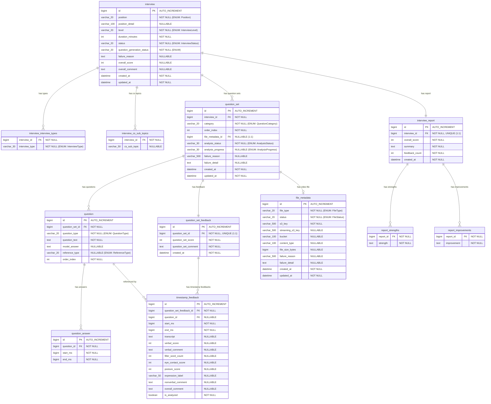

# Rehearse ERD — Entity Relationship Diagram

> 최종 업데이트: 2026-03-20

## ERD 다이어그램



---

## 테이블 상세

### 1. `interview` — 면접 세션

| 컬럼 | 타입 | 제약조건 | 설명 |
|------|------|----------|------|
| `id` | `BIGINT` | PK, AUTO_INCREMENT | 면접 세션 ID |
| `position` | `VARCHAR(20)` | NOT NULL | 포지션 (ENUM: Position) |
| `position_detail` | `VARCHAR(100)` | NULLABLE | 포지션 상세 설명 |
| `level` | `VARCHAR(20)` | NOT NULL | 경력 레벨 (ENUM: InterviewLevel) |
| `duration_minutes` | `INT` | NOT NULL | 면접 시간(분) |
| `status` | `VARCHAR(20)` | NOT NULL | 면접 상태 (ENUM: InterviewStatus) |
| `question_generation_status` | `VARCHAR(20)` | NOT NULL | 질문 생성 상태 (ENUM: QuestionGenerationStatus) |
| `failure_reason` | `TEXT` | NULLABLE | 질문 생성 실패 사유 |
| `overall_score` | `INT` | NULLABLE | 종합 점수 (분석 완료 후) |
| `overall_comment` | `TEXT` | NULLABLE | 종합 코멘트 (분석 완료 후) |
| `created_at` | `DATETIME` | NOT NULL | 생성 시각 (JPA Auditing) |
| `updated_at` | `DATETIME` | NOT NULL | 수정 시각 (JPA Auditing) |

- 소스: `com.rehearse.api.domain.interview.entity.Interview`

### 2. `interview_interview_types` — 면접 유형 (ElementCollection)

| 컬럼 | 타입 | 제약조건 | 설명 |
|------|------|----------|------|
| `interview_id` | `BIGINT` | FK → `interview.id`, NOT NULL | 면접 세션 참조 |
| `interview_type` | `VARCHAR(30)` | NOT NULL | 면접 유형 (ENUM: InterviewType) |

### 3. `interview_cs_sub_topics` — CS 세부 주제 (ElementCollection)

| 컬럼 | 타입 | 제약조건 | 설명 |
|------|------|----------|------|
| `interview_id` | `BIGINT` | FK → `interview.id`, NOT NULL | 면접 세션 참조 |
| `cs_sub_topic` | `VARCHAR(50)` | NULLABLE | CS 세부 주제명 |

### 4. `question_set` — 질문 세트

| 컬럼 | 타입 | 제약조건 | 설명 |
|------|------|----------|------|
| `id` | `BIGINT` | PK, AUTO_INCREMENT | 질문 세트 ID |
| `interview_id` | `BIGINT` | FK → `interview.id`, NOT NULL | 면접 세션 참조 |
| `category` | `VARCHAR(20)` | NOT NULL | 카테고리 (ENUM: QuestionCategory) |
| `order_index` | `INT` | NOT NULL | 세트 순서 |
| `file_metadata_id` | `BIGINT` | FK → `file_metadata.id`, NULLABLE | 녹화 영상 파일 참조 (1:1) |
| `analysis_status` | `VARCHAR(30)` | NOT NULL | 분석 상태 (ENUM: AnalysisStatus) |
| `analysis_progress` | `VARCHAR(30)` | NULLABLE | 분석 진행 단계 (ENUM: AnalysisProgress) |
| `failure_reason` | `VARCHAR(500)` | NULLABLE | 분석 실패 사유 |
| `failure_detail` | `TEXT` | NULLABLE | 분석 실패 상세 |
| `created_at` | `DATETIME` | NOT NULL | 생성 시각 |
| `updated_at` | `DATETIME` | NOT NULL | 수정 시각 |

- 관계: `interview` → `question_set` (1:N, `@ManyToOne(fetch=LAZY)`)
- 관계: `question_set` → `file_metadata` (1:1, `@OneToOne(fetch=LAZY)`)
- 소스: `com.rehearse.api.domain.questionset.entity.QuestionSet`

### 5. `question` — 질문

| 컬럼 | 타입 | 제약조건 | 설명 |
|------|------|----------|------|
| `id` | `BIGINT` | PK, AUTO_INCREMENT | 질문 ID |
| `question_set_id` | `BIGINT` | FK → `question_set.id`, NOT NULL | 질문 세트 참조 |
| `question_type` | `VARCHAR(20)` | NOT NULL | 질문 유형 (ENUM: QuestionType) |
| `question_text` | `TEXT` | NOT NULL | 질문 내용 |
| `model_answer` | `TEXT` | NULLABLE | 모범 답안 |
| `reference_type` | `VARCHAR(20)` | NULLABLE | 참조 유형 (ENUM: ReferenceType) |
| `order_index` | `INT` | NOT NULL | 질문 순서 |

- 관계: `question_set` → `question` (1:N, `CASCADE ALL`, `orphanRemoval`)
- 정렬: `@OrderBy("orderIndex ASC")`
- 소스: `com.rehearse.api.domain.questionset.entity.Question`

### 6. `question_answer` — 질문 답변 (타임스탬프)

| 컬럼 | 타입 | 제약조건 | 설명 |
|------|------|----------|------|
| `id` | `BIGINT` | PK, AUTO_INCREMENT | 답변 ID |
| `question_id` | `BIGINT` | FK → `question.id`, NOT NULL | 질문 참조 |
| `start_ms` | `BIGINT` | NOT NULL | 답변 시작 시점 (ms) |
| `end_ms` | `BIGINT` | NOT NULL | 답변 종료 시점 (ms) |

- 관계: `question` → `question_answer` (1:N, `@ManyToOne(fetch=LAZY)`)
- 소스: `com.rehearse.api.domain.questionset.entity.QuestionAnswer`

### 7. `question_set_feedback` — 질문 세트 피드백

| 컬럼 | 타입 | 제약조건 | 설명 |
|------|------|----------|------|
| `id` | `BIGINT` | PK, AUTO_INCREMENT | 피드백 ID |
| `question_set_id` | `BIGINT` | FK → `question_set.id`, NOT NULL, UNIQUE | 질문 세트 참조 (1:1) |
| `question_set_score` | `INT` | NOT NULL | 질문 세트 점수 |
| `question_set_comment` | `TEXT` | NOT NULL | 질문 세트 코멘트 |
| `created_at` | `DATETIME` | NOT NULL | 생성 시각 |

- 관계: `question_set` → `question_set_feedback` (1:1, `@OneToOne(fetch=LAZY), unique=true`)
- 소스: `com.rehearse.api.domain.questionset.entity.QuestionSetFeedback`

### 8. `timestamp_feedback` — 타임스탬프 피드백

| 컬럼 | 타입 | 제약조건 | 설명 |
|------|------|----------|------|
| `id` | `BIGINT` | PK, AUTO_INCREMENT | 타임스탬프 피드백 ID |
| `question_set_feedback_id` | `BIGINT` | FK → `question_set_feedback.id`, NOT NULL | 질문 세트 피드백 참조 |
| `question_id` | `BIGINT` | FK → `question.id`, NULLABLE | 질문 참조 |
| `start_ms` | `BIGINT` | NOT NULL | 피드백 시작 시점 (ms) |
| `end_ms` | `BIGINT` | NOT NULL | 피드백 종료 시점 (ms) |
| `transcript` | `TEXT` | NULLABLE | STT 변환 텍스트 |
| `verbal_score` | `INT` | NULLABLE | 언어적 점수 |
| `verbal_comment` | `TEXT` | NULLABLE | 언어적 피드백 |
| `filler_word_count` | `INT` | NULLABLE | 불필요 단어 횟수 |
| `eye_contact_score` | `INT` | NULLABLE | 시선 접촉 점수 |
| `posture_score` | `INT` | NULLABLE | 자세 점수 |
| `expression_label` | `VARCHAR(50)` | NULLABLE | 표정 레이블 |
| `nonverbal_comment` | `TEXT` | NULLABLE | 비언어적 피드백 |
| `overall_comment` | `TEXT` | NULLABLE | 종합 피드백 |
| `is_analyzed` | `BOOLEAN` | NOT NULL | 분석 완료 여부 |

- 관계: `question_set_feedback` → `timestamp_feedback` (1:N, `CASCADE ALL`, `orphanRemoval`)
- 소스: `com.rehearse.api.domain.questionset.entity.TimestampFeedback`

### 9. `file_metadata` — 파일 메타데이터

| 컬럼 | 타입 | 제약조건 | 설명 |
|------|------|----------|------|
| `id` | `BIGINT` | PK, AUTO_INCREMENT | 파일 ID |
| `file_type` | `VARCHAR(20)` | NOT NULL | 파일 유형 (ENUM: FileType) |
| `status` | `VARCHAR(20)` | NOT NULL | 파일 상태 (ENUM: FileStatus) |
| `s3_key` | `VARCHAR(500)` | NOT NULL | S3 원본 키 (WebM) |
| `streaming_s3_key` | `VARCHAR(500)` | NULLABLE | S3 스트리밍 키 (MP4) |
| `bucket` | `VARCHAR(100)` | NULLABLE | S3 버킷명 |
| `content_type` | `VARCHAR(100)` | NULLABLE | MIME 타입 |
| `file_size_bytes` | `BIGINT` | NULLABLE | 파일 크기 (bytes) |
| `failure_reason` | `VARCHAR(500)` | NULLABLE | 실패 사유 |
| `failure_detail` | `TEXT` | NULLABLE | 실패 상세 |
| `created_at` | `DATETIME` | NOT NULL | 생성 시각 |
| `updated_at` | `DATETIME` | NOT NULL | 수정 시각 |

- 관계: `question_set` → `file_metadata` (1:1, `@OneToOne(fetch=LAZY)`)
- 소스: `com.rehearse.api.domain.file.entity.FileMetadata`

### 10. `interview_report` — 종합 리포트

| 컬럼 | 타입 | 제약조건 | 설명 |
|------|------|----------|------|
| `id` | `BIGINT` | PK, AUTO_INCREMENT | 리포트 ID |
| `interview_id` | `BIGINT` | FK → `interview.id`, NOT NULL, UNIQUE | 면접 세션 참조 (1:1) |
| `overall_score` | `INT` | NOT NULL | 종합 점수 |
| `summary` | `TEXT` | NOT NULL | 종합 요약 |
| `feedback_count` | `INT` | NOT NULL | 피드백 수 |
| `created_at` | `DATETIME` | NOT NULL | 생성 시각 |

- 관계: `interview` → `interview_report` (1:1, `@OneToOne(fetch=LAZY), unique=true`)
- 소스: `com.rehearse.api.domain.report.entity.InterviewReport`

### 11. `report_strengths` — 리포트 강점 (ElementCollection)

| 컬럼 | 타입 | 제약조건 | 설명 |
|------|------|----------|------|
| `report_id` | `BIGINT` | FK → `interview_report.id`, NOT NULL | 리포트 참조 |
| `strength` | `TEXT` | NOT NULL | 강점 내용 |

### 12. `report_improvements` — 리포트 개선점 (ElementCollection)

| 컬럼 | 타입 | 제약조건 | 설명 |
|------|------|----------|------|
| `report_id` | `BIGINT` | FK → `interview_report.id`, NOT NULL | 리포트 참조 |
| `improvement` | `TEXT` | NOT NULL | 개선점 내용 |

---

## Enum 정의

### Position (포지션)

| 값 | 설명 |
|----|------|
| `BACKEND` | 백엔드 |
| `FRONTEND` | 프론트엔드 |
| `DEVOPS` | 데브옵스 |
| `DATA_ENGINEER` | 데이터 엔지니어 |
| `FULLSTACK` | 풀스택 |

### InterviewLevel (경력 레벨)

| 값 | 설명 |
|----|------|
| `JUNIOR` | 주니어 |
| `MID` | 미드 |
| `SENIOR` | 시니어 |

### InterviewType (면접 유형)

| 값 | 설명 | 대상 |
|----|------|------|
| `CS_FUNDAMENTAL` | CS 기초 | 공통 |
| `BEHAVIORAL` | 인성/행동 면접 | 공통 |
| `RESUME_BASED` | 이력서 기반 | 공통 |
| `JAVA_SPRING` | Java/Spring | 백엔드 |
| `SYSTEM_DESIGN` | 시스템 설계 | 백엔드 |
| `FULLSTACK_JS` | 풀스택 JS | 풀스택 |
| `REACT_COMPONENT` | React 컴포넌트 | 프론트엔드 |
| `BROWSER_PERFORMANCE` | 브라우저 성능 | 프론트엔드 |
| `INFRA_CICD` | 인프라/CI·CD | 데브옵스 |
| `CLOUD` | 클라우드 | 데브옵스 |
| `DATA_PIPELINE` | 데이터 파이프라인 | 데이터 |
| `SQL_MODELING` | SQL/모델링 | 데이터 |

### InterviewStatus (면접 상태)

```
READY → IN_PROGRESS → COMPLETED
```

| 값 | 설명 | 전이 가능 |
|----|------|-----------|
| `READY` | 준비 완료 | → `IN_PROGRESS` |
| `IN_PROGRESS` | 진행 중 | → `COMPLETED` |
| `COMPLETED` | 완료 | 전이 불가 |

### QuestionGenerationStatus (질문 생성 상태)

```
PENDING → GENERATING → COMPLETED
                    → FAILED → PENDING (재시도)
```

| 값 | 설명 |
|----|------|
| `PENDING` | 대기 |
| `GENERATING` | 생성 중 |
| `COMPLETED` | 완료 |
| `FAILED` | 실패 |

### QuestionCategory (질문 카테고리)

| 값 | 설명 |
|----|------|
| `RESUME` | 이력서 기반 |
| `CS` | CS 기초 |

### QuestionType (질문 유형)

| 값 | 설명 |
|----|------|
| `MAIN` | 메인 질문 |
| `FOLLOWUP` | 후속 질문 |

### ReferenceType (참조 유형)

| 값 | 설명 |
|----|------|
| `MODEL_ANSWER` | 모범 답안 |
| `GUIDE` | 가이드 |

### AnalysisStatus (분석 상태)

```
PENDING → PENDING_UPLOAD → ANALYZING → COMPLETED
      → SKIPPED                     → FAILED → PENDING_UPLOAD (재시도)
```

| 값 | 설명 | 전이 가능 |
|----|------|-----------|
| `PENDING` | 대기 | → `PENDING_UPLOAD`, `SKIPPED`, `FAILED` |
| `PENDING_UPLOAD` | 업로드 대기 | → `ANALYZING`, `FAILED` |
| `ANALYZING` | 분석 중 | → `COMPLETED`, `FAILED` |
| `COMPLETED` | 완료 | → `FAILED` |
| `FAILED` | 실패 | → `PENDING_UPLOAD`, `ANALYZING`, `COMPLETED` |
| `SKIPPED` | 건너뜀 | 전이 불가 |

### AnalysisProgress (분석 진행 단계)

| 값 | 설명 |
|----|------|
| `STARTED` | 시작 |
| `EXTRACTING` | FFmpeg 추출 중 |
| `STT_PROCESSING` | Whisper STT 처리 중 |
| `VERBAL_ANALYZING` | 언어 분석 중 (GPT-4o) |
| `NONVERBAL_ANALYZING` | 비언어 분석 중 (GPT-4o Vision) |
| `FINALIZING` | 최종 처리 중 |
| `FAILED` | 실패 |

### FileType (파일 유형)

| 값 | 설명 |
|----|------|
| `VIDEO` | 녹화 영상 |
| `RESUME` | 이력서 PDF |

### FileStatus (파일 상태)

```
PENDING → UPLOADED → CONVERTING → CONVERTED
                                → FAILED → UPLOADED (재시도)
```

| 값 | 설명 | 전이 가능 |
|----|------|-----------|
| `PENDING` | 대기 | → `UPLOADED`, `FAILED` |
| `UPLOADED` | 업로드 완료 | → `CONVERTING`, `FAILED` |
| `CONVERTING` | 변환 중 | → `CONVERTED`, `FAILED` |
| `CONVERTED` | 변환 완료 | → `FAILED` |
| `FAILED` | 실패 | → `UPLOADED` |

---

## 관계 요약

| 관계 | 타입 | JPA 매핑 | 비고 |
|------|------|----------|------|
| `interview` → `interview_interview_types` | 1:N | `@ElementCollection` | 단방향 |
| `interview` → `interview_cs_sub_topics` | 1:N | `@ElementCollection` | 단방향 |
| `interview` → `question_set` | 1:N | `@ManyToOne(fetch=LAZY)` | 단방향 (QuestionSet → Interview) |
| `interview` → `interview_report` | 1:1 | `@OneToOne(fetch=LAZY), unique=true` | 단방향 (Report → Interview) |
| `question_set` → `question` | 1:N | `@OneToMany(cascade=ALL, orphanRemoval=true)` | 양방향 |
| `question_set` → `file_metadata` | 1:1 | `@OneToOne(fetch=LAZY)` | 단방향 (QuestionSet → FileMetadata) |
| `question_set` → `question_set_feedback` | 1:1 | `@OneToOne(fetch=LAZY), unique=true` | 단방향 (Feedback → QuestionSet) |
| `question` → `question_answer` | 1:N | `@ManyToOne(fetch=LAZY)` | 단방향 (Answer → Question) |
| `question_set_feedback` → `timestamp_feedback` | 1:N | `@OneToMany(cascade=ALL, orphanRemoval=true)` | 양방향 |
| `timestamp_feedback` → `question` | N:1 | `@ManyToOne(fetch=LAZY)` | 단방향 (nullable) |
| `interview_report` → `report_strengths` | 1:N | `@ElementCollection` | 단방향 |
| `interview_report` → `report_improvements` | 1:N | `@ElementCollection` | 단방향 |
