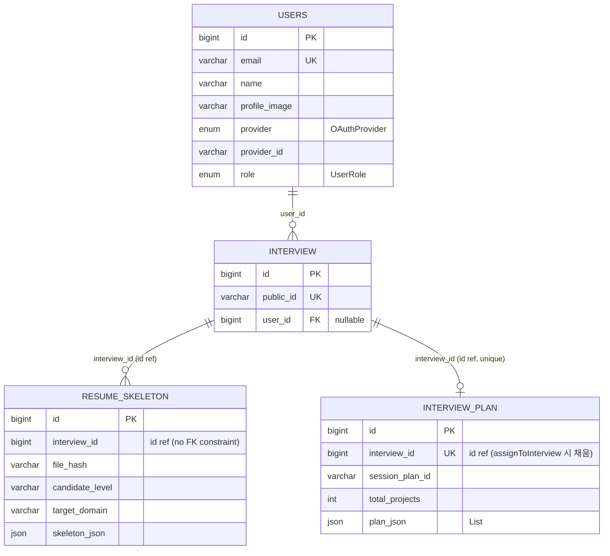

# User + Resume Aggregate

## 범위

- `domain/user/entity/User`
- `domain/resume/entity/ResumeSkeletonEntity`
- `domain/resume/entity/InterviewPlan`

`Interview` 는 다음 파일 [02-interview-question.md](./02-interview-question.md) 에서 상세. 여기선 관계만 표시.

## 다이어그램

## 메모

- `User.userId` 는 nullable — 익명 인터뷰 가능 (legacy 호환).
- `ResumeSkeleton.interviewId` 는 JPA 매핑 없는 implicit id (`@Column` 만). 같은 interview 에 여러 skeleton 누적 가능 (file_hash 기준 캐시 / 재업로드).
- `InterviewPlan.interviewId` 는 unique — 인터뷰당 1 plan. 초기엔 null 로 생성 후 `assignToInterview()` 로 묶임.
- `User.providerId + provider` 가 외부 OAuth 식별자 — login lookup 키.
