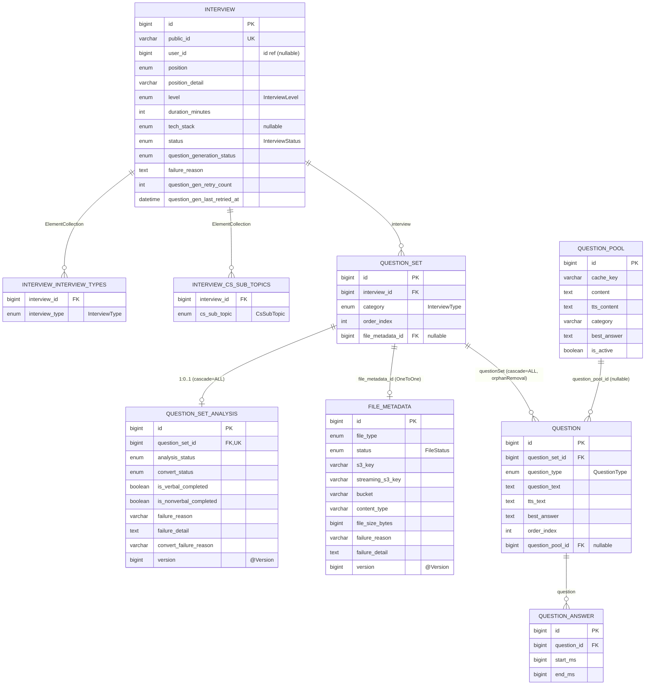

# Interview + Question Aggregate

## 범위

- `domain/interview/entity/Interview` (+ 보조 테이블 2)
- `domain/question/entity/QuestionSet`
- `domain/question/entity/Question`
- `domain/question/entity/QuestionAnswer`
- `domain/question/entity/QuestionPool`
- `domain/question/entity/QuestionSetAnalysis`
- `domain/file/entity/FileMetadata`

## 다이어그램

## 메모

- `Interview` 는 `interviewTypes` / `csSubTopics` 두 ElementCollection 보조 테이블 보유. 각각 별도 row.
- `QuestionSet ↔ QuestionSetAnalysis` = 1:0..1. `cascade=ALL` 로 함께 생성/삭제. analysis 가 없으면 `AnalysisStatus.PENDING` 으로 간주.
- `QuestionSet ↔ FileMetadata` = OneToOne. 파일 없는 question_set 가능 (resume-only 등).
- `QuestionPool` 은 `Question` 다수가 참조하는 캐시 풀. nullable — 풀 미사용 질문 (resume-based) 도 존재.
- `Question.bestAnswer` = AI 모범 답안. `QuestionAnswer` 는 사용자 답변 타임스탬프 (start/end ms).
- `QuestionSetAnalysis.version` / `FileMetadata.version` = `@Version` 낙관락 (동시성 제어).
