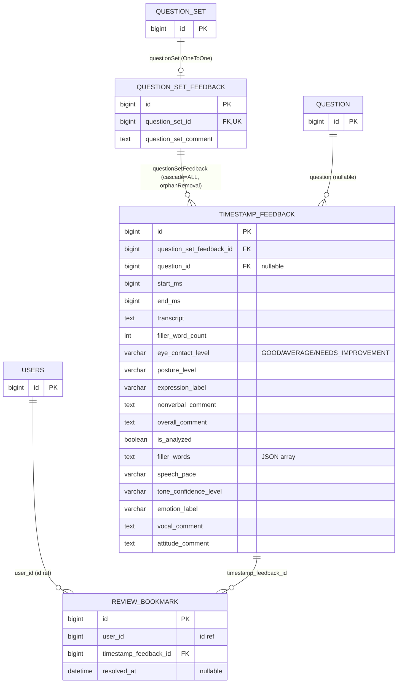

# Feedback Aggregate

## 범위

- `domain/feedback/entity/QuestionSetFeedback`
- `domain/feedback/entity/TimestampFeedback`
- `domain/reviewbookmark/entity/ReviewBookmark`

`QuestionSet` / `Question` / `User` 는 다른 파일 참조. 여기선 관계만 표시.

## 다이어그램

## 메모

- `QuestionSetFeedback` = QuestionSet 1 개당 1 개 (unique). 전체 답변 종합 코멘트.
- `TimestampFeedback` = 영상 구간 (start_ms~end_ms) 단위 피드백. Lambda 비언어 분석 결과 (eye contact / posture / filler / emotion 등) 동거.
- `ReviewBookmark.uniqueConstraint = (user_id, timestamp_feedback_id)` — 동일 사용자가 같은 구간 중복 북마크 방지.
- `ReviewBookmark.resolvedAt` null = 미해결, 값 있음 = 해결됨. `markResolved()` / `reopen()` 으로 토글.
- `ReviewBookmark` 는 `@NamedEntityGraph` 로 timestampFeedback → question / questionSet → interview 까지 한 번에 fetch (조회 N+1 방지).
