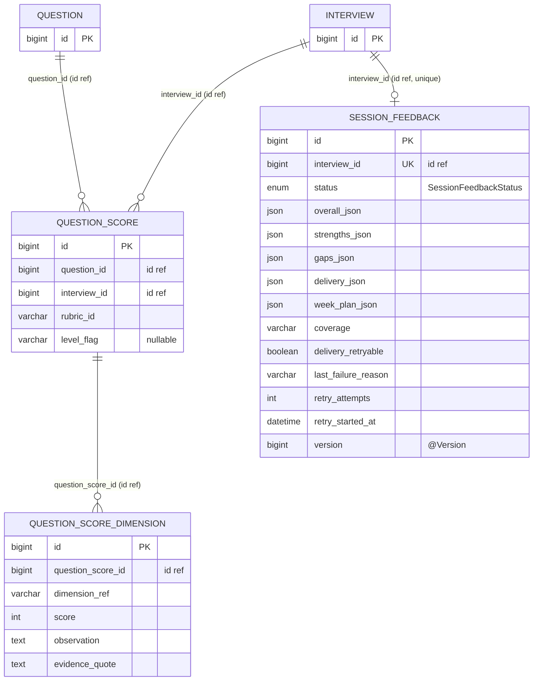

# Score / Session Feedback

## 범위

- `domain/feedback/score/entity/QuestionScore`
- `domain/feedback/score/entity/QuestionScoreDimension`
- `domain/feedback/session/entity/SessionFeedback`

JPA 조인 매핑 없는 implicit id FK 만 사용 — 도메인 경계 분리 의도.

## 다이어그램

## 메모

- 모든 FK 가 implicit id (`Long xxxId`) — JPA 객체 그래프로 묶지 않음. 의도: 다른 도메인 (interview / question) 과 약결합 유지 + 점수 도메인 독립 진화.
- `QuestionScore` = 한 질문에 대한 rubric 평가. `rubric_id` + `level_flag` 로 어떤 rubric 어느 level 적용했는지 식별.
- `QuestionScoreDimension` = QuestionScore 의 차원별 점수 (dimension_ref ↔ Rubric 도메인 정의). score / observation / evidence_quote.
- `Rubric` 도메인 (`feedback/rubric/entity/`) = 모두 enum / VO record (DB 영속 X). 코드 상수로 정의되어 score 측에서 ref 만 보유.
- `SessionFeedback` = 인터뷰 1 회당 1 개 (unique). 5 종 JSON 페이로드 (overall / strengths / gaps / delivery / week_plan).
- `SessionFeedback.deliveryRetryable` + `retry_attempts` + `retryStartedAt` = 비동기 delivery enrichment 재시도 추적. 60s 쿨다운.
- `SessionFeedback.version` = `@Version` 낙관락 — 동시 enrichment 충돌 방지.
