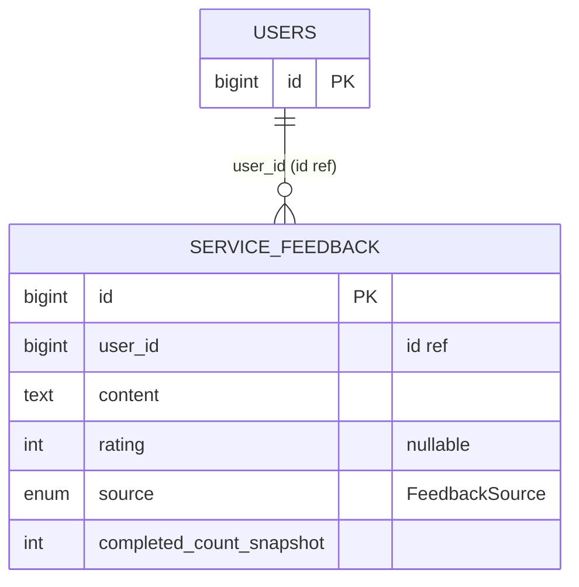

# Misc

## 범위

- `domain/servicefeedback/entity/ServiceFeedback`

다른 도메인과 직접 관계 없음. 사용자 → 서비스 피드백 (NPS / 만족도) 단방향.

## 다이어그램

## 메모

- `completed_count_snapshot` = 피드백 작성 시점의 사용자 인터뷰 완료 횟수 스냅샷 (시간 흐른 뒤에도 어느 단계 사용자였는지 기록).
- `source` = 어디서 작성했는지 (예: 대시보드, 결과 페이지 등). enum 값 정의는 `FeedbackSource.java`.
- `rating` 은 nullable — 텍스트만 작성 케이스 허용.
