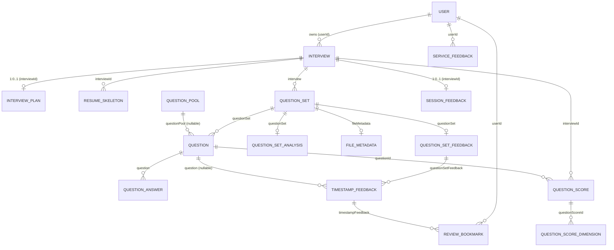

# Backend ERD

`backend/src/main/java/com/rehearse/api/domain/**/entity/` JPA `@Entity` 17 종 기반 자동 작성. Mermaid `erDiagram` 으로 GitHub 렌더 가능.

## 분할

| 파일 | 범위 |
|------|------|
| [01-user-resume.md](./01-user-resume.md) | User + Resume aggregate (ResumeSkeleton, InterviewPlan) |
| [02-interview-question.md](./02-interview-question.md) | Interview + Question aggregate (QuestionSet, Question, QuestionAnswer, QuestionPool, QuestionSetAnalysis, FileMetadata) |
| [03-feedback.md](./03-feedback.md) | Feedback aggregate (QuestionSetFeedback, TimestampFeedback, ReviewBookmark) |
| [04-score-session.md](./04-score-session.md) | Score / Session feedback (QuestionScore, QuestionScoreDimension, SessionFeedback) |
| [05-misc.md](./05-misc.md) | ServiceFeedback |

## 표기 규칙

- 관계 표기 (Mermaid):
  - `||--o{` 1 : 0..N
  - `||--|{` 1 : 1..N
  - `||--||` 1 : 1
  - `}o--||` N : 1
- **FK (JPA join)** = `@ManyToOne` / `@OneToOne` / `@OneToMany(mappedBy)` 명시된 관계.
- **FK (implicit id)** = `Long xxxId` 컬럼만 보유 (JPA join 없음). 관계선 위 `(id ref)` 표시.
- ElementCollection (별도 join 테이블) = 보조 테이블로 노출.
- Auditing (`createdAt`, `updatedAt`) 은 표기 생략.

## 통합 개요 (핵심 엔티티만)

상세 컬럼 / 인덱스 / FK 컬럼명은 분할 파일 참조.
