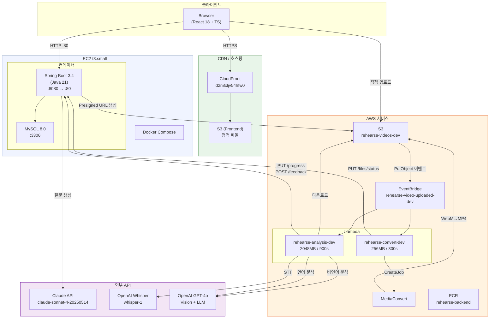
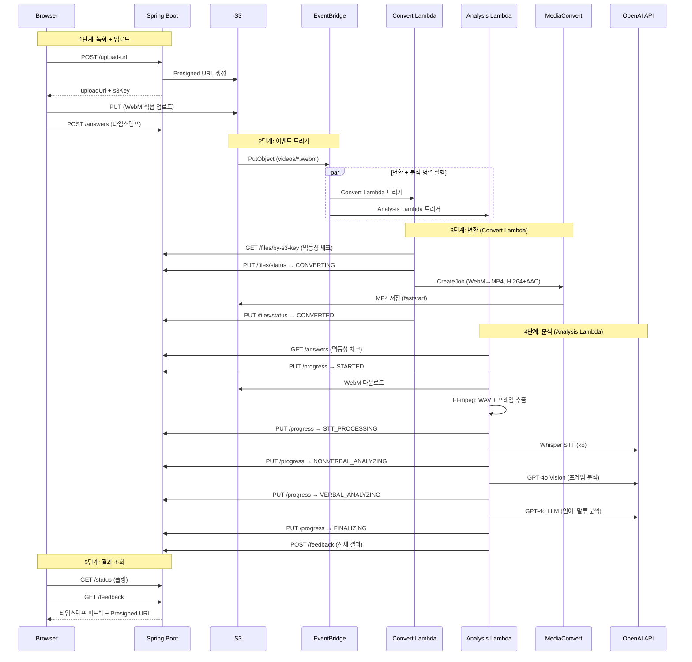
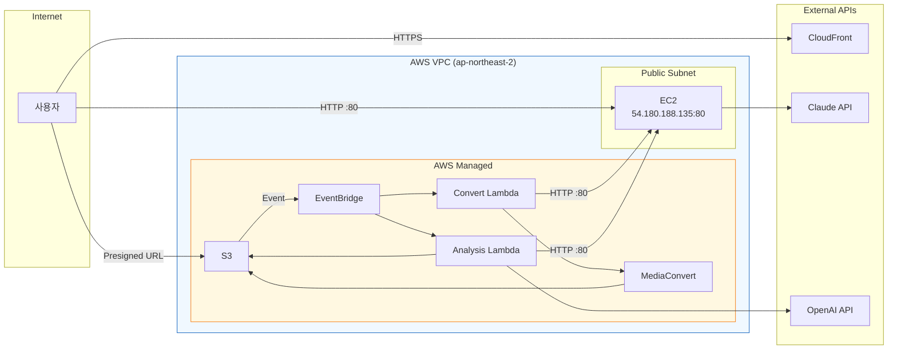
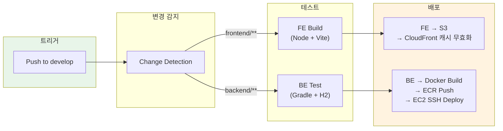

# Rehearse 인프라 현황 (2026-03-18)

## 1. 전체 시스템 아키텍처



## 2. 녹화-분석-변환 파이프라인



## 3. AWS 리소스 상세

### 3.1 EC2

| 항목 | 값 |
|------|-----|
| Instance ID | `i-0d1d65843d4c37f9b` |
| Type | t3.small (2 vCPU, 2GB RAM) |
| AMI | Ubuntu |
| Public IP | `54.180.188.135` |
| Private IP | `172.31.7.196` |
| Key Pair | `rehearse-key.pem` |
| Security Group | `sg-082751d93d0991dd3` |

**Security Group 인바운드 규칙:**

| 포트 | 프로토콜 | 소스 | 용도 |
|------|----------|------|------|
| 22 | TCP | 0.0.0.0/0 | SSH |
| 80 | TCP | 0.0.0.0/0 | BE API (Docker 80→8080) |
| 8080 | TCP | 0.0.0.0/0 | Lambda → BE 직접 접근 |

**Docker Compose 구성:**

| 컨테이너 | 이미지 | 포트 | 네트워크 |
|-----------|--------|------|----------|
| rehearse-backend | ECR/rehearse-backend:latest | 80→8080 | backend_default |
| rehearse-db | mysql:8.0 | 3306→3306 | backend_default |

### 3.2 S3

| 항목 | 값 |
|------|-----|
| Bucket | `rehearse-videos-dev` |
| Region | ap-northeast-2 |

**디렉토리 구조:**
```
rehearse-videos-dev/
├── videos/{interviewId}/qs_{questionSetId}.webm   ← 원본 녹화
├── videos/{interviewId}/qs_{questionSetId}.mp4    ← MediaConvert 변환
├── analysis-backup/{id}/qs_{qsId}.json            ← 분석 실패 시 백업
└── layers/ffmpeg-layer.zip                         ← Lambda Layer 소스
```

### 3.3 EventBridge

| 항목 | 값 |
|------|-----|
| Rule | `rehearse-video-uploaded-dev` |
| State | ENABLED |
| Pattern | S3 PutObject → `videos/*.webm` |
| Targets | rehearse-convert-dev, rehearse-analysis-dev |

### 3.4 Lambda

#### rehearse-convert-dev (WebM → MP4 변환)

| 항목 | 값 |
|------|-----|
| Runtime | Python 3.12 |
| Memory | 256 MB |
| Timeout | 300초 (5분) |
| Handler | handler.lambda_handler |

**환경변수:**

| 변수 | 값 |
|------|-----|
| API_SERVER_URL | `http://54.180.188.135:80` |
| INTERNAL_API_KEY | `rehearse-internal-dev-key-2026` |
| S3_BUCKET | `rehearse-videos-dev` |
| MEDIACONVERT_ENDPOINT | (계정별 엔드포인트) |
| MEDIACONVERT_ROLE | `arn:aws:iam::776735194358:role/rehearse-mediaconvert-role` |

#### rehearse-analysis-dev (AI 분석 파이프라인)

| 항목 | 값 |
|------|-----|
| Runtime | Python 3.12 |
| Memory | 2048 MB |
| Timeout | 900초 (15분, Lambda 최대) |
| Handler | handler.lambda_handler |
| Layer | `ffmpeg-static:1` (FFmpeg 7.x, 56MB) |

**환경변수:**

| 변수 | 값 |
|------|-----|
| API_SERVER_URL | `http://54.180.188.135:80` |
| INTERNAL_API_KEY | `rehearse-internal-dev-key-2026` |
| S3_BUCKET | `rehearse-videos-dev` |
| OPENAI_API_KEY | (설정됨) |

### 3.5 IAM

#### rehearse-lambda-execution (Lambda 실행 역할)

| 정책 | 권한 |
|------|------|
| AWSLambdaBasicExecutionRole | CloudWatch Logs |
| rehearse-lambda-s3-mediaconvert | S3 Get/Put/Head, MediaConvert Create/Get/Describe, iam:PassRole |

#### rehearse-mediaconvert-role (MediaConvert 서비스 역할)

| 정책 | 권한 |
|------|------|
| S3Access | S3 Get/Put (`rehearse-videos-dev/*`) |

### 3.6 MediaConvert

| 항목 | 값 |
|------|-----|
| Input | WebM (VP9 + Opus/Vorbis) |
| Output | MP4 (H.264 HIGH + AAC 128kbps) |
| MOOV Placement | PROGRESSIVE_DOWNLOAD (faststart) |
| Rate Control | QVBR (Quality Level 7, MaxBitrate 5Mbps) |

### 3.7 ECR

| 항목 | 값 |
|------|-----|
| Repository | `776735194358.dkr.ecr.ap-northeast-2.amazonaws.com/rehearse-backend` |
| Tag | `latest` |
| Base Image | `eclipse-temurin:21-jre` |

### 3.8 CloudFront + S3 (Frontend)

| 항목 | 값 |
|------|-----|
| Distribution | `d2n8xljv54hfw0.cloudfront.net` |
| Origin | S3 (정적 빌드 파일) |
| Framework | React 18 + Vite |

### 3.9 Lambda Layer

| Layer | 버전 | 내용 | 크기 |
|-------|------|------|------|
| ffmpeg-static | 1 | FFmpeg 7.x + FFprobe (Linux x86_64 static) | 56MB |

## 4. 네트워크 흐름



## 5. CI/CD 파이프라인



## 6. 환경변수 관리

### EC2 (`~/rehearse/backend/.env`)
```
DB_URL, DB_USERNAME, DB_PASSWORD, DB_ROOT_PASSWORD
SPRING_PROFILES_ACTIVE=dev
CLAUDE_API_KEY
OPENAI_API_KEY
INTERNAL_API_KEY
CORS_ALLOWED_ORIGINS
ECR_REGISTRY
AWS_ACCESS_KEY_ID, AWS_SECRET_ACCESS_KEY, AWS_REGION
```

### Lambda 환경변수
```
API_SERVER_URL=http://54.180.188.135:80
INTERNAL_API_KEY
S3_BUCKET=rehearse-videos-dev
OPENAI_API_KEY          (analysis만)
MEDIACONVERT_ENDPOINT   (convert만)
MEDIACONVERT_ROLE       (convert만)
```

## 7. 비용 추정 (월간, dev 환경)

| 서비스 | 예상 비용 |
|--------|-----------|
| EC2 t3.small | ~$15/월 |
| RDS-free / Docker MySQL | $0 |
| S3 (10GB 이하) | ~$0.25 |
| Lambda (100회 분석) | ~$1 |
| MediaConvert (100건) | ~$2 |
| CloudFront | ~$1 |
| **합계** | **~$20/월** |
