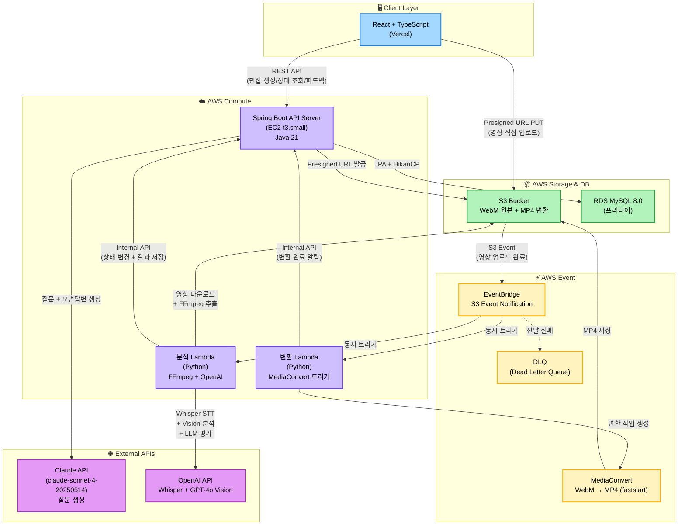
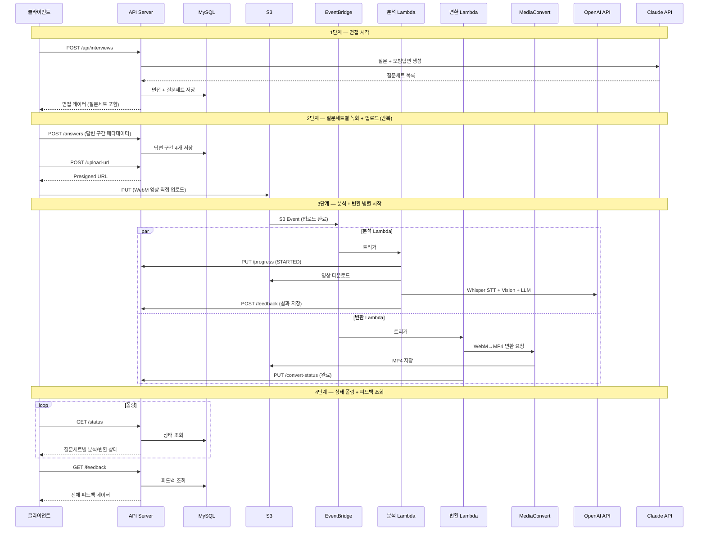
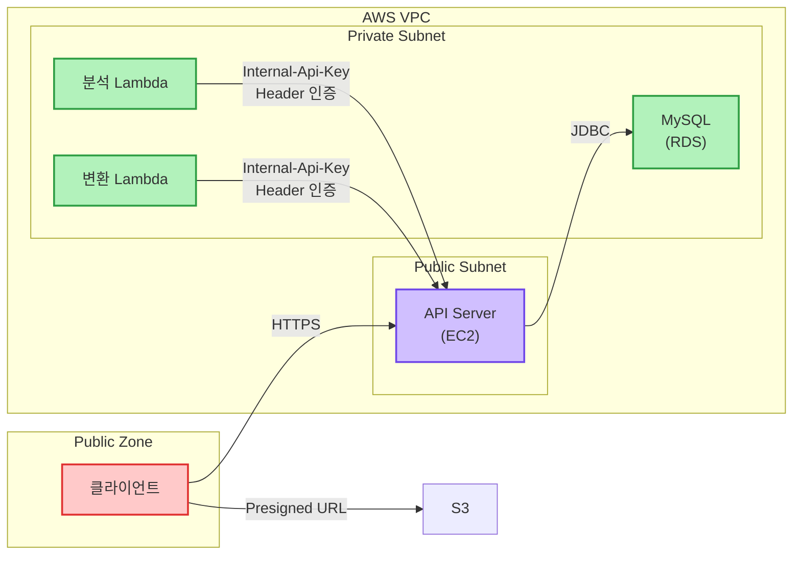

# 시스템 인프라 다이어그램

## 전체 아키텍처

## 데이터 흐름 (질문 세트 단위)

## 인프라 컴포넌트 상세

| 컴포넌트 | 기술 | 역할 | 비고 |
|----------|------|------|------|
| 프론트엔드 | React 18 + TS (Vercel) | 면접 UI, 영상 녹화, 피드백 뷰어 | MediaRecorder, Web Speech API |
| API 서버 | EC2 t3.small + Spring Boot 3.4 | 세션 관리, Presigned URL, Internal API | JVM: -Xms512m -Xmx512m |
| DB | RDS MySQL 8.0 (프리티어) | 면접/답변/피드백 저장 | HikariCP 커넥션 풀 |
| 영상 저장 | S3 | WebM 원본 + MP4 변환 | Lifecycle Rule 적용 |
| 이벤트 | EventBridge | S3 이벤트 → Lambda 트리거 | DLQ 설정 |
| 분석 Lambda | Python | FFmpeg + Whisper + Vision + LLM | Reserved Concurrency 3~5 |
| 변환 Lambda | Python | MediaConvert 작업 생성 | 30초~1분 소요 |
| MediaConvert | AWS Elemental | WebM → MP4 (faststart) | 질문세트당 ~$0.12 |
| AI (질문) | Claude API | 질문 + 모범답변 생성 | Backend에서만 호출 |
| AI (분석) | OpenAI API | STT + 비언어 분석 + 언어 평가 | 질문세트당 ~$0.26 |

## 보안 아키텍처

